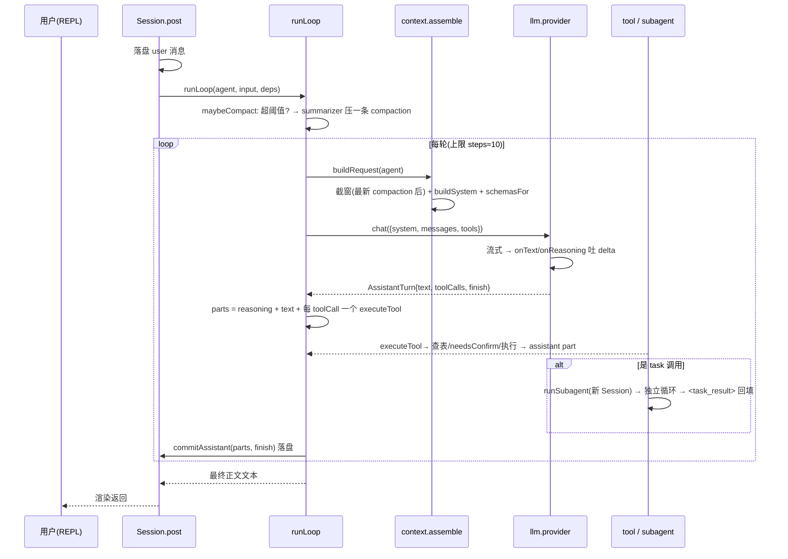

# talemate 当前架构与流程（权威总览）

> 日期：2026-09-07（目录重构后）
> 定位：**当前实现的权威总览**，以 `src/` 代码为准。早期过程/设计记录见 `04-harness-design.md`；Agent/工具规范见 `05-agent-spec.md`、`prompts/README.md`。
>
> 本文回答："talemate 现在到底长什么样、一次交互怎么走、两个阶段怎么咬合"。一切以代码为准，本文如与代码冲突优先代码。

---

## 0. 一句话定位

talemate = 一个"**活的小说项目空间**"承载的、由多角色创作 Agent 围绕"**活的企划书**"工作的系统。把企划做厚、写正文章节前先做规划（节拍）+ 用户当主编拍板；**无事后打分/评判循环**。用户是主编，Agent 是参谋与执行者。

---

## 1. 顶层形态（模块分层）

```
                 talemate CLI (src/cli.ts, REPL)          ← 入口: new <书名> / ls / use / <id>
                        │  REPL 斜杠命令 /sid 输出渲染
                        ▼
   session/     Session(post) + openSession + runSubagent  ← 会话接线 + task 委派
                 │
   ┌─────────────┼──────────────────────────────────────────────┐
   │             │                                              │
   ▼             ▼                                              ▼
agent/         tool/          18 工具(按 agent 白名单可见)        framework/      领域层
registry.ts  (define/registry/runner + 5 域模块)              anchor/report/characters/design_spec/
角色声明        └ design_tools·character_tools·framework_tools·core_tools·web_tools   markdown/search/layers
   │                                                                │
   ▼                                                                ▼
context/  assemble(buildSystemPrompt, toNeutralMessages)            存储能力经 ToolContext 注入
   │
   ▼
llm/  provider(anthropic/openai/mock) + 工具循环 + 流式
   │
   ▼
storage/  project.ts(project+design) · session-store.ts(session+messages) · util.ts
skill/     SKILL.md 发现与注入
```

依赖方向（实际 import 边）：`cli → session → {agent, tool, framework, context, llm, storage, skill}`；`context/llm/skill` 是叶；`tool/runner` 不依赖 Session。

---

## 2. 项目空间目录（当前布局）

```
受管根目录 (env TALEMATE_HOME, 默认 ~/.talemate/)
└── novels/<project-id>/            ← 一小说一目录（用户只认书名）
    ├── talemate.json               # 项目元信息: id/书名/题材/createdAt/agents.<id> 覆盖
    ├── AGENTS.md                   # 用户自己的项目规矩(不预建·可空); 存在才每轮注入(06 §6.3)
    ├── design/                     # ◀ 企划活文档(懒建——文件被写才出现)
    │   ├── core.md                 #   核心层: 小说介绍(常驻)
    │   ├── wiki/                   #   世界层 = wiki
    │   │   ├── world.md            #     总纲入口(常驻): 空间与舞台/规则与秩序/术语表
    │   │   └── <题>.md             #     专题页(按需读, 自由新增): 地理/势力/历史…
    │   ├── characters/             #   人物层: 一角色一卡(无派生总表; 名单由 list-designs 现算)
    │   │   └── <名>.md             #     # 角色:<名> + 常驻四格/按需格/「当前」/开放长尾
    │   └── outline/                #   情节层: 主线→章节的规划
    │       ├── outline.md          #     整本: 一句话主线/开篇钩子/分卷/结局/伏笔登记
    │       ├── plan_ch<N>.md       #     章节细纲(从 chapters/ 迁入)
    │       └── vol_*.md            #     分卷细纲
    ├── chapters/                   # ◀ 成品正文 chapter_ch<N>_v<M>.md
    ├── skills/                     # 项目级 SKILL.md(可选)
    └── .talemate/sessions/<id>/    # 会话元 session.json + messages.jsonl
```

**懒建 / 常驻**：`createProject` 只建目录不种文件（`design/` 初始为空）；`core.md` 与 `wiki/world.md` 由 `buildResidentDesigns` 每轮**现读**注入 editor（无状态包装、不缓存），wiki 专题页/characters/outline 全部按需 `read-design`。

---

## 3. Agent 角色（`src/agent/registry.ts`）

| 角色 | mode | 职责 | 谁触发它 | 工具 |
|---|---|---|---|---|
| **editor 主编** | primary | 唯一对话面 + 项目执掌：引导把企划做厚、按需编排 planner/writer 并拍板 | 用户每次输入 | 17 个（读写文档/角色/design-spec/task/skill/ask-user/confirm/webfetch/websearch） |
| **planner 规划** | subagent | 通用结构师：节拍/整本·分卷大纲/级联重排 | editor 经 `task` | read-design / list-designs / skill |
| **writer 写手** | subagent | 按切片+节拍写一章正文，只输出正文 | editor 经 `task` | read-design / list-designs / skill / save-chapter |
| **summarizer** | hidden | 上下文压缩生成前情摘要 | harness 内部 | 无 |

- editor **不亲自写正文**；planner/writer **不能直接对话**只被 task 派生；无导演/评审/拍板 agent（拍板永远是人）。
- persona（system）：editor/planner/writer/summarizer 全在 `prompts/*.txt`（英文，`readPrompt()` 载入）；agent `description`（路由契约，英文）内联于 `registry.ts`，写法见 `prompts/README.md`「描述 · agent description 路由规范」。

---

## 4. 工具（18 个，`src/tool/`）

**design_tools**（design/ 通用文档）
`read-design` `list-designs`(含小节索引) `search-designs` `propose-design` `apply-design` `append-design` `remove-design-section`

> **design 写入是两段的（2026-09-12）**：`propose-design` 把草稿摆给用户看（**不写盘**，并结束本回合），
> 用户回话后 `apply-design` 才落盘——且只落提案的那一份（它不接受正文）。
> 于是"用户看过的 == 落盘的"由构造保证。旧的 `write-design` / `edit-design` **已删除**。
>
> **固定层的路径由代码定（2026-09-13）**：核心层/世界观/大纲用 `layer` 参数，路径从 `DESIGN_SPECS` 取；
> 只有真正开放的文档（`wiki/<题>.md` 专题页、`outline/plan_ch<N>.md` 细纲、角色卡）才用 `name` 给路径。
> 起因：实测模型会把世界层写成 `design/world.md`，而 `RESIDENT_DESIGNS` 只认 `wiki/world.md`——
> **写错位置的世界层不会被常驻注入，等于白写且用户看不出来**。`name` 分支另有一条守卫：把某一层的
> 主文档写到别处会被拒，并把正确路径给回去让它自纠。

**character_tools**（人物层）
`add-character` `update-character` `remove-character`

**framework_tools**
`design-spec`(按需拿某层"结构规范+成稿做法")

**core_tools**（委派/知识/人机交互）
`task` `skill` `ask-user` `confirm` `save-chapter`

**web_tools**（联网，editor/planner 可见）
`webfetch`（抓一个 URL → text/markdown/html）`websearch`（搜索：默认 tavily(有 key)；无 key 回退 bocha/exa/duckduckgo，见 .env.example）

可见性由各角色 `tools` 白名单决定；`schemasFor` 给 `task` 动态拼上可委派 subagent 清单。

> ⚠️ **白名单只管"广告"，不是执行边界**：`AgentDef.tools` 只决定 `schemasFor` 喂给模型哪些 schema；
> 执行时查的是**全局** registry（`session.ts` 把 `this.tools` 传给 `executeToolPart`，`runner.ts` 按 id 查表）。
> 所以**撤下一个工具必须真删定义**（从 `DESIGN_TOOLS` 等数组里移除），只从白名单拿掉等于没拿掉。

---

## 5. 会话循环（一次交互，核心流程）

`session/session.ts` 的 `post()` → `session/loop.ts` 的 `runLoop()`。这是"一条输入 → N 轮 生成↔工具"的链条。



要点：
- **每轮一条 assistant 消息**落盘（text/reasoning/tool 各一个 part）；工具内嵌 part，`pending→running→completed/error`。
- **循环停 = 本轮无 tool-call / 有工具要求 `halt` / 达 steps**；有 tool-call → 下一轮把结果作为 `role:"tool"` 回放给模型。
- **`halt`（2026-09-12）**：工具在**成功**时可要求结束本回合（`ToolDef.halt`，目前只有 `propose-design` 用），
  把控制权交回用户。同回合剩下的 tool call 不再执行，但**必须补一个带各自 id 的 `error` part**——
  `assemble` 只回放 `completed`/`error` 的 part，而 assistant 消息登记了全部 `toolCalls`，少一个就是静默的坏请求。
  工具**失败时不能 halt**，否则循环死在一个本可自愈的错误上。
- **task 委派** = 独立 Session（depth+1），只传 prompt、不限继承全量工具；结果 `<task_result>` 文本回传父会话；深度 ≤1（`session.ts:runSubagent` 限制）。
- **上下文压缩**：`loadModelWindow` 只取最新 compaction 之后的 seq；老消息留盘不喂模型。

---

## 6. editor 手下的两类活：企划成型 与 章节生产

editor **没有阶段状态机**（"设计段/写作段"已删除，`designActive` 连同其标签一并移除）。它在同一个会话里做两类活，界限不是 harness 强制的，而是**用户点名驱动**：用户说"完善核心设定 / 加角色林晚"就走**企划成型**，说"写第 N 章"就走**章节生产**。

```mermaid
flowchart TD
    A[进入项目: 四层现状卡片 + 提示] --> B{用户现在要什么?}
    B -- 完善某层 / 加角色 --> P[企划成型]
    B -- 写第 N 章 --> W[章节生产]
    P --> P1[调 design-spec 拿该层结构规范]
    P1 --> P2[按小节把用户自由描述整成草稿<br/>没讲到的写(待定)]
    P2 --> P3[propose-design 摆出草稿<br/>不写盘, 本回合结束且不再请求模型]
    P3 --> P3b{用户回话}
    P3b -- 没问题 --> P3c[apply-design 落盘(只落提案那一份)]
    P3b -- 要改 --> P2
    P3c --> P4{这层还有关键格(待定/要改)?}
    P4 -- 是 --> P5[propose-design 那一格(带 section) → 给建议/选项, 一次可多答]
    P5 --> P4
    P4 -- 否 --> P6[向用户报一句: 当前已定 + 还待定]
    P6 --> P7{用户冒出新点子/推翻旧设定?}
    P7 -- 是 --> P8[判定归哪层; search-designs 查影响面;<br/>小改 propose-design 一格, 大级联 task planner]
    P8 --> P6
    P7 -- 否 --> B
    W --> W1[read-design 取当前 core+相关切片<br/>+(plan_ch 若有)]
    W1 --> W2{已有细纲?}
    W2 -- 否 --> W3[task planner 出节拍 → 给用户拍板]
    W3 --> W4
    W2 -- 是 --> W4[task writer 带切片+节拍写正文]
    W4 --> W5[writer save-chapter 落 chapters/<br/>+ task_result 回传 editor]
    W5 --> W6[editor 面向用户确认, 拍板定稿]
    W6 --> B
```

- **企划成型工作法**：不逐格盘问 → 让用户自由讲 → 按 design-spec 小节整理（缺写（待定））→ `propose-design` 摆出草稿等用户回话（**不写盘**）→ 他说没问题才 `apply-design` 落盘 → 之后仅 `propose-design` 还待定/要改的那一格（带 `section`）。
- **章节生产纪律（软约束，存于 editor 协议）**：写某章前先有已批准的细纲（`design/outline/plan_ch<N>.md`），无则先 task planner 出节拍再写——这是 editor 的工作纪律，不是 harness 硬门禁。

---

## 7. 关键机制

| 机制 | 落点 |
|---|---|
| **多角色** = 数据（AgentDef） | 加角色只写 AgentDef + tools 白名单，不改 loop/registry |
| **Task 委派** | 隔离上下文、只传 prompt；可派清单由 `subagentCatalog()` 动态进 task 描述 |
| **懒建 + design-spec** | 文件不预种；editor `design-spec` 拿结构 → 成稿 → propose-design → 用户回话 → apply-design |
| **常驻注入** | `buildResidentDesigns` 现读 `core.md`+`wiki/world.md`；仅可见 primary；无 `<nvl-state>` 包装 |
| **寻址** | 文档名 = `design/` 相对路径（`safeRelPath` 防穿越）；`wiki/<题>.md`、`characters/<名>.md` |
| **一角色一卡（无派生总表）** | `characters/<名>.md` 分常驻带/按需格/工具托管的「当前」+ 开放长尾；名单由 `list-designs` **现算**（一人一行：身份 + 常驻带齐没齐）。设计见 `09-character-layer-design.md` |
| **强制纪律进工具** | design 落盘走**提案两段式**（`propose-design` 的 `halt` 结束回合 → `apply-design` 只落提案那一份，且要 harness 判定的"用户已同意"）；删除走 confirm + `remove-design-section`/`remove-character` 内置 `search-designs` 引用检查——模型"想跳过也跳不过" |
| **提案的"同意"由 harness 判** | `Session.markPendingApproval` 按用户回话匹配同意词（没问题/可以/好/…）置位；模型自述无效。fail-closed：措辞不常见就多走一轮，绝不写用户没认可的东西 |
| **上下文压缩** | `compact()` 用 hidden summarizer 生成 `<story-state>`（summary+recent），“最新 compaction 之后”为上下文 |
| **推理强度** | `TALEMATE_REASONING`（low/high/max/off）；anthropic `thinking` / openai `reasoning_effort` |

---

## 8. 验证（当前全绿）

```
bun run typecheck   # tsc --noEmit
bun test            # 46 pass（markdown 手术 / design-spec / 懒建 / 搜索 / 常驻注入 / 一角色一卡 /
                    #          提案往返与守卫 / 渲染器 / runLoop 的 halt 与同意判定）
bun run smoke       # mock 全链路：建项目 → editor → task 委派 writer → 落盘；断言 design/ 初始为空
```

命令行：`talemate new <书名> [题材]` · `talemate ls` · `talemate use <id|书名>`；REPL 内 `/help` 看命令。
