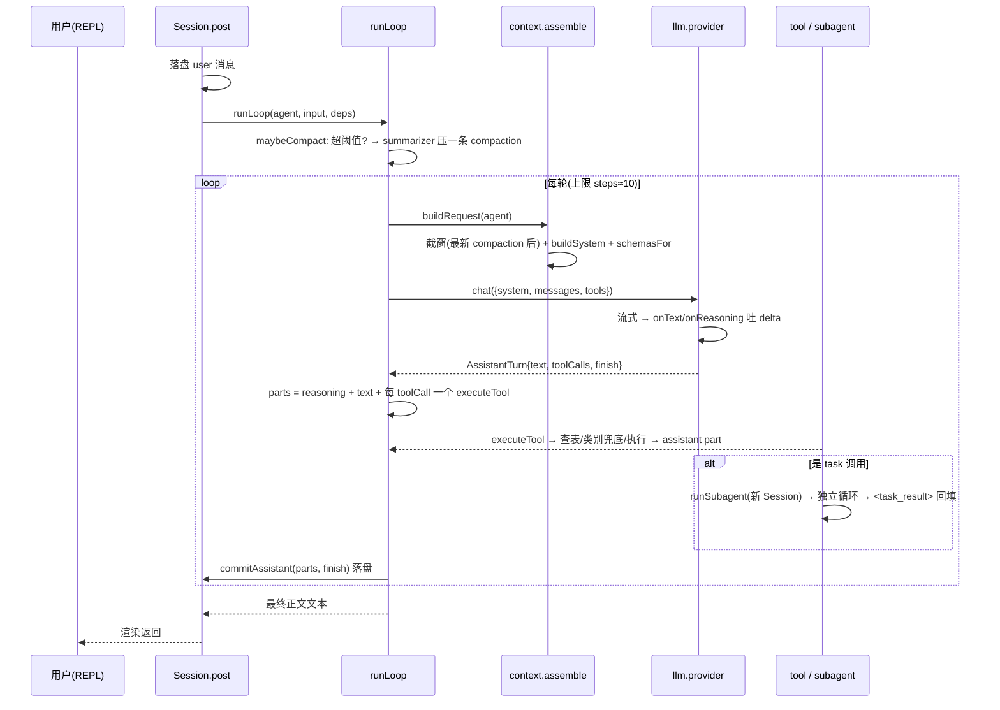

# 架构：harness 长什么样、一次交互怎么走

> **职责**：回答"代码怎么组织、一次请求从进到出经过什么"。
> **读者**：要改 `src/` 的人。
> **对齐代码**：2026-09-20 · 本文与代码冲突时**以代码为准**
> 相邻：`agents.md`（Agent 与工具）· `design-docs.md`（写作领域）· `product.md`（为什么这么设计）

## 模块分层

```
                 talemate CLI (src/cli.ts, REPL)          ← 入口: new <书名> / ls / use / <id>
                        │  REPL 斜杠命令 / 输出渲染
                        ▼
   session/     Session(post) + openSession + runSubagent  ← 会话接线 + task 委派
                 │
   ┌─────────────┼──────────────────────────────────────────────┐
   ▼             ▼                                              ▼
agent/         tool/       内置工具(按 agent 白名单可见)          framework/   领域层
registry.ts  (define/registry/runner + 5 域模块)             anchor/report/characters/design_spec/
角色声明                                                      markdown/search/layers/proposal/write_ops/match
   │                                                                │
   ▼                                                                ▼
context/  assemble(buildSystemPrompt, toNeutralMessages)         存储能力经 ToolContext 注入
   │
   ▼
llm/  provider(anthropic/openai/mock) + 工具循环 + 流式
   │
   ▼
storage/  project.ts(project+design) · session-store.ts(session+messages) · util.ts
skill/    SKILL.md 发现与注入
```

依赖方向（实际 import 边）：`cli → session → {agent, tool, framework, context, llm, storage, skill}`；`context/llm/skill` 是叶；`tool/runner` 不依赖 Session。

## 技术栈

| 项 | 选择 | 理由 |
|---|---|---|
| 语言 | **TypeScript** | 参考架构（OpenCode）同语言，借思路最顺 |
| 运行时 | **Bun** | all-in-one：包管理 / TS 直接跑 / 测试器 / 打包器，零构建配置；OpenCode 也是 Bun 原生 |
| 框架风格 | **不用 Effect** | 学习成本高、招人难，对独立产品是负担。用清晰的模块边界 + 直接代码 |
| 存储 | **文件系统** | 无数据库；未来多用户/并发再评估 SQLite |

## 项目空间目录

```
受管根目录 (env TALEMATE_HOME, 默认 ~/.talemate/)
└── novels/<project-id>/            ← 一小说一目录（用户不碰路径，只认书名）
    ├── talemate.json               # 项目元信息: id/书名/题材/createdAt/agents.<id> 覆盖
    ├── AGENTS.md                   # 用户自己的项目规矩（不预建·可空）；存在才每轮注入
    ├── design/                     # ◀ 企划活文档（懒建——文件被写才出现）
    │   ├── core.md                 #   核心层: 小说介绍（常驻）
    │   ├── wiki/                   #   世界层 = wiki
    │   │   ├── world.md            #     总纲入口（常驻）: 空间与舞台/规则与秩序/术语表
    │   │   └── <题>.md             #     专题页（按需读，自由新增）: 地理/势力/历史…
    │   ├── characters/             #   人物层: 一角色一卡（无派生总表，名单现算）
    │   │   └── <名>.md             #     # 角色:<名> + 必有五格 + 自由长尾
    │   └── outline/                #   情节层: 卷 → 序列（**没有"整本大纲"这个文档**）
    │       ├── vol_<N>.md          #     卷纲: 位置/目标与阻力/情绪曲线/卷末状态/本卷的序列
    │       ├── vol_<N>/s<序号>.md  #     序列纲: 整篇散文、不分小节，一个情节单元一个文件
    │       └── plan_ch<N>.md       #     章节细纲（"不该进 design/"已定，落点未定）
    ├── chapters/                   # ◀ 成品正文 chapter_ch<N>_v<M>.md
    ├── skills/                     # 项目级 SKILL.md（可选）
    └── .talemate/sessions/<id>/    # 会话元 session.json + messages.jsonl
```

**会话放在项目目录里**：会话是"围绕这部小说的讨论记录"，跟作品同目录便于整体备份/迁移/进 git；但它**不属于作品内容**（只有 `design/` 与 `chapters/` 算）。

**懒建**：`createProject` 只建目录不种文件，`design/` 初始为空。文件由写入产生。

## 会话循环

`session/session.ts` 的 `post()` → `session/loop.ts` 的 `runLoop()`。这是"一条输入 → N 轮 生成↔工具"的链条。



要点：

- **每轮一条 assistant 消息**落盘（text / reasoning / tool 各一个 part）；工具内嵌 part，走 `pending→running→completed/error`。
- **循环停 = 本轮无 tool-call / 有工具要求 `halt` / 达 steps**；有 tool-call → 下一轮把结果作为 `role:"tool"` 回放。
- **`halt`**：工具在**成功**时可要求结束本回合（`ToolDef.halt`，目前只有 `propose-design` 用），把控制权交回用户。同回合剩下的 tool call 不再执行，但**必须补一个带各自 id 的 `error` part**——`assemble` 只回放 `completed`/`error` 的 part，而 assistant 消息登记了全部 `toolCalls`，少一个就是静默的坏请求。**工具失败时不能 halt**，否则循环死在一个本可自愈的错误上。
- **task 委派** = 独立 Session（depth+1），只传 prompt；结果 `<task_result>` 文本回传父会话；深度 ≤1。
- **单队列**：busy 时新输入排队，不做 steer/queue 多级语义。

## 上下文组装

对每个 agent 的每次请求，system prompt 由四块拼成：

```
system = [
  env/date 块（今天日期 / 项目名 / 角色）
  角色 system（agent.system —— 写手在这里含写作规范）
  项目规则（AGENTS.md 全文注入，来源标注 "Instructions from: …"）
  skills 目录清单（<available_skills>: name+description，无正文）
]
messages = 按 compaction 截断后的历史 + 刚读的设定切片
          （切片拼进本条 user/task prompt，**不塞 system**）
```

四条规则：

1. **AGENTS.md = 常驻、每步全量注入**。内容归用户——项目级、用户管理、**默认可空、不预建**；系统只提供"存在就注入"的能力。**产品核心行为不得依赖它**：路径约定归工具，分层工作法归 design-spec，写作与命名纪律归各角色 system。
2. **Skill = 目录化、按需注入**。正文不常驻；system 只给清单，命中后用 `skill` 工具把正文作为 tool-result 带进来。
3. **活文档 = 工具读取、按需切片**。要什么读什么，读到的内容作为 user 侧材料。**例外：`core.md` + `wiki/world.md` 每轮现读全文注入**（见下）。
4. **取当前版本**：写作/task 委派时现读，绝不引用缓存。

### 常驻注入

`buildResidentDesigns` 现读 `core.md` + `wiki/world.md` 全文，**只给可见的 primary（mate）**——subagent 不注入（省 token，靠 task prompt 切片）。无状态包装、不缓存。

## 上下文压缩

长篇唯一的硬约束。

- **触发**：估算字符数超阈值。
- **产物 = 一条 compaction 消息**（`summary` + `recent`）：`summary` 是 LLM 按**小说向模板**生成的摘要（当前写到哪 / 已定设定 / 未回收伏笔 / 下一步），即 `<story-state>` 语义。
- **上下文边界**：只取最新 compaction 之后的 seq；老消息留文件不喂模型。恢复时找到那条 compaction 即得"前情摘要 + 最近原文"。
- 摘要由 hidden agent `summarizer` 生成，可单独配小模型。

## LLM 层

```ts
chat({ model, system, messages, tools?, signal?, onText?, onReasoning? }): Promise<AssistantTurn>
// AssistantTurn = { text, reasoning?, toolCalls, finish: "stop"|"tool_calls"|"error", usage? }
```

- provider 无关：anthropic / openai 兼容（DeepSeek、Moonshot 含推理）/ mock。
- 内部流式，期间经 `onText`/`onReasoning` 实时吐 delta，返回聚合结果。未采用 `AsyncIterable<LLMEvent>`。
- 保留：max_tokens 截断检测、temperature、按角色推理强度（`TALEMATE_REASONING`，低档经 `reasoning_effort`/`thinking` 传）。

## 存储

借鉴 opencode 的 "durable 事件 + 投影" 里"该落哪些值"的规则，落到文件：

- **`session.json`**：会话元（id / projectID / title / agent / model / cost / tokens / time）。
- **`messages.jsonl`**：每行一条消息，**必须含 `seq`**；类型 `user / assistant / system / synthetic / compaction`。
  - assistant 的 content = `[{ text, reasoning, tool: [{id, name, state, input, output, time}] }]`。
- **规则：delta 仅 live 不落盘，ended/complete 才是落盘的全值**——文件里只有稳定态。
- **compaction 消息必落**，它是恢复上下文的关键。
- `seq` 单调递增；消息顺序 = 文件顺序 = seq 顺序。
- 全部 `fs/promises`，无数据库。

## 边界与演进

**当前形态 = 库 + CLI**，无 HTTP。

**模块边界必须让 server 能成为另一个薄外壳，核心不感知 UI**。为此"事件广播"已经是核心内部接口（`onEvent(evt)`）——CLI 先打印，将来接 SSE。

未来稳定契约（借鉴 opencode 最小子集，暂不实现）：`POST /api/session` · `POST /api/session/:id/prompt` · `GET /api/session/:id/message`（投影）· `GET /api/session/:id/event?after=seq`（SSE replay-then-live）· `POST /interrupt`。届时薄 TUI = "先拉投影 + 事件增量更新本地读模型"。

## 从 OpenCode 借的与剥掉的

| 借 | 剥 |
|---|---|
| agent 循环形状（工具结果先落再喂下一轮） | bash / fs-edit / pty / grep / glob / LSP / MCP |
| task 子会话 = 独立 Session、只传 prompt、限深 | allow/ask/deny 权限级联 → 简化为"默认放行 + 工具自声明 confirm" |
| Agent 纯声明 + 无导演 + 消息绑角色 | SQLite + 事件溯源 + projector → 文件系统 + jsonl |
| Skill 目录注入（system 只放 name+description） | V1/V2 双栈、双协议、迁移债 |
| 规则文件常驻全量注入 | OTel / 云同步 / todo |
| 事件分类：delta live-only、ended durable | |
