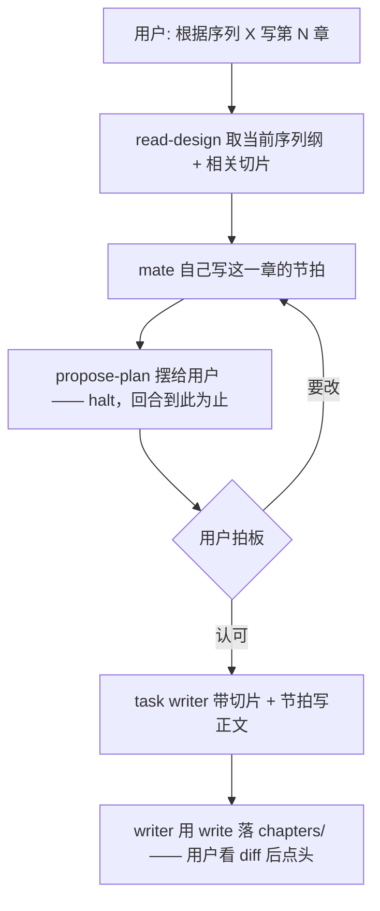

# 设计文档体系：四层活文档与两段式落盘

> **职责**：回答"企划由哪些文档构成、怎么写进去、怎么改"。
> **读者**：要改 `src/framework/`（design_spec / write_ops / proposal / layers）或 `src/tool/design_tools.ts` 的人。
> **对齐代码**：2026-09-22 · 层元信息在 `framework/layers.ts`，结构规范在 `framework/design_spec.ts`
> 相邻：`characters.md`（人物层单独一份）· `outline.md`（情节层单独一份）· `agents.md`（工具的注册与触发）· `product.md`（产品主流程）

## 四层

设计段的产物是**一组分层、持续迭代、随时可改的活文档**。分层的意义：层间**变化频率、影响范围、再生成范围**不同，维护与注入都按层处理。

| 层 | 文档 | 变化特征 | 注入方式 |
|---|---|---|---|
| **核心层** | `design/core.md` | 极少变、一改牵全身、用户必须拍板 | **常驻**注入 |
| **世界层** | `design/wiki/world.md` + `wiki/<题>.md` | 慢变、追加为主；长尾拆专题页 | 总纲**常驻**；专题页按需读 |
| **人物层** | `design/characters/<名>.md` | 慢变 | 按需读（见 `characters.md`） |
| **情节层** | `design/outline/vol_<N>.md`（卷纲）+ `vol_<N>/s<序号>.md`（序列纲） | 快变、最局部 | 按需读（当前卷 / 序列切片） |

**常驻只有两份**：`core.md` 与 `wiki/world.md`（`RESIDENT_LAYERS` 标的是层 id，路径由 `DESIGN_SPECS` 现取）。其余按需 `read-design`。常驻注入只给可见的 primary（mate）。

**文档格式**：Markdown，`##` 即一格。**读**按"文件名 + 小节标题"寻址（`read-design` 的 `section`）；**写**按**锚点**寻址（`edit` 给一段原文与替换文本，见"两种落盘形态"）。不做条目级 ID 引用。

## 懒建：文件不预种

`createProject` 只建目录、不种文件——`design/` 初始为空。用户要完善某层时，mate 调 `design-spec` 拿该层的结构规范（该有哪些小节、每格装什么、成稿做法），据此成稿。

**结构与内容分离**：`design_spec.ts` 只定义"长什么样"；文件一旦建立即内容与真相。所以 `design-spec` 是**参考**，不是校验器——文档不按规范组织也能存在，只是模型没拿到引导。

## 两种落盘形态

> **用户看过的字节 == 落盘的字节。** 两条路各用各的材料来满足它，都走**同一条流水线**
> （`framework/write_ops.ts`），区别只在**字节从哪来**：

| | 字节从哪来 | 模型可见的工具 | 用户看到什么 |
|---|---|---|---|
| **二向** | 模型**当场组合**（它给 `content` 或 `find`/`replace`） | `write` · `edit` | 一段 **diff**，弹窗问 接受 / 拒绝 |
| **三向** | **从已审阅的提案取**（模型给不了字节） | `apply-design` | 一份**逐格提案**，回话 接受 / 拒绝 / 提意见 |

落盘那条路上，两者汇进同一个 `writeFile`：解析目标 → 读 → 算结果 → 算 diff → 取批准 → CAS + 原子写。

**三向**（`propose-design` → 用户回话 → `apply-design`）：

- **`propose-design` 的 `halt`**：结束本回合，把控制权交回用户。同回合剩下的 tool call 不再执行——但必须补 `error` part（见 `architecture.md` 的 halt 说明）。
- **"同意"由 harness 判**：`Session.markPendingApproval` 按用户回话判**三种结局**（`draftVerdict`：接受 / 拒绝 / 提意见），**模型自述无效**。fail-closed：措辞不常见一律算"提意见"，多走一轮，绝不误判成接受。
- **出口条件是"接受或拒绝"，不是"提案成功"**：提意见留在草稿模式里接着改，所以一次设计会话只进一次模式。
- **并发保护**：提案登记 `base` 快照，落盘前若文件已变则拒绝（CAS）。
- **`apply-design` 不弹窗**——用户已在提案里看过内容；但它**仍然过规则表**，"不许"不因为问过一次就失效。

**为什么三向要这么设计**：一段式（模型当场给字节又自己声称"用户同意了"）等于没有门。三向里
`apply-design` **拿不到正文**——字节只从提案登记取（`proposal.ProposalOp`）——所以模型**想夹带
用户没看过的字也夹带不了**，是"写不出来"而不是"会被检查拦住"。

**提案只有整篇一种形态。** 局部修改走二向的 `edit`：用户看 diff 就够，不必再读一遍全文。想让
用户细看的那一版，哪怕只动了一格，也整篇提出来——渲染里的 `★本版改动` 会指出动过哪几格。

## 寻址：`layer` 与 `name`

| 参数 | 用于 | 路径 |
|---|---|---|
| `layer` | core / world 两个**主文档是一个文件**的层 | 由 `DESIGN_SPECS[layer].file` 定，**模型拼不出错** |
| `name` | 其余全部：`outline/vol_<N>.md`、`outline/vol_<N>/s<序号>.md`、`wiki/<题>.md`、`outline/plan_ch<N>.md`、`characters/<名>.md` | 模型自报 `design/` 相对路径 |

两条守卫：

- **`layer` 与 `name` 互斥**，且 `characters` 与 `outline` **都不是**可写的 layer（它们的 file 是目录）——给了会指回 `name:"characters/<名>.md"` / `name:"outline/vol_<N>.md"`。
- **某一层的主文档不许写到别处**：给 `name:"world.md"` 会被拒并把正确路径给回去让它自纠。起因是实测模型把世界层写成 `design/world.md`，而常驻表只认 `DESIGN_SPECS.world.file`（今天就是 `wiki/world.md`）——**写错位置的世界层不会被常驻注入，等于白写且用户看不出来**。

## 文档级的守卫

- **可审阅性**：判据是"**字节摆得到用户眼前吗**"，不是"分不分格"。有规范登记的层，没按该层规范的小节组织 → 拒绝提案（否则几格全显示「待定」，整段散文却照样落盘）；**无规范登记的文档放行**——整篇散文会被兜底成"整篇一格"摆出来。
- **不在任何格里的字节也单独摆一段**（`proposal.uncoveredText`）：文档标题行、`##` 之前的导语。渲染只认 `items[].body` 的话，这些字节会被整个跳过，而它们照样落盘——"用户看过的字节 == 落盘的字节"就成了假的。
- **角色卡的 `##` 陷阱**：`proposal.ownItems` 取**最浅**标题层。角色卡上冒出任意一个 `##`，卡里**所有** `###` 都从逐格审阅里消失。所以 `propose-design` 与 `append-design` 对角色卡都拒收 `##`（`cardHeadingError`）——详见 `characters.md`。
- **删除**：`delete` 内置 `search-designs` 引用检查，命中结果摆进 confirm——**级联清理由模型自己用 `edit` 做**，工具只负责把影响面摆出来。

## 章节生产

**一次只规划一章**，因为节拍是**序列纲的投影**：序列纲说"这一节要兑现什么"，节拍说"这一章怎么兑现"。

**门有两道，都挂在 `propose-plan` 这一环上：**

- **摆出来就停**：它带 `halt`，不靠模型自觉。
- **没拍板就不许写**：它把节拍登记进会话内存，用户回话后由 harness 置 `approved`；`task(writer)` 查这一位，没批准就拒绝，并把"先 propose-plan"给回去。**这和 `apply-design` 是同一套**——propose 登记 → harness 判同意 → 执行工具查它。门开在**执行那一头**而不是给整个会话加个模式，是为了让设计流程与正文流程**共用一种"用户拍板"的语义**。

节拍**不落盘**：它批准的是**动作**（去写正文），不是一份文档。那份登记只活在会话内存里（`Session.pending`，storage 层完全不认识它），靠 `renderPendingNote` 每轮注入 system 抵抗压缩。**一次批准只换一次写作**——`task(writer)` 成功后即清，下一章要重新摆、重新拍板。

**mate 没有阶段状态机**："设计段/写作段"不是代码里的状态，而是**用户点名驱动**——说"完善核心设定"就走企划成型，说"写第 N 章"就走章节生产。

## 写作依赖当前版本

每次 task 委派写手，prompt 里带"当前 core 切片 + 相关 world/characters 切片 + 细纲切片"——**绝不缓存旧设定**。写作/task 委派时一律现读。

## 相关源码

| 文件 | 职责 |
|---|---|
| `framework/layers.ts` | 层的**显示名与顺序**（id / title）＋常驻表（标的是层 id）。**路径不在这里**——见 `design_spec.ts` |
| `framework/design_spec.ts` | 结构规范的**两张表**：`DESIGN_SPECS` 按层（`file` 精确匹配）+ `DOC_SPECS` 按路径模式（卷纲 / 序列纲）。每份规范 = 写什么 / 别写什么 / 写成什么样 + 成稿工作法 |
| `framework/write_ops.ts` | **写盘唯一路径**：解析目标 → 读 → 算结果 → diff → 取批准 → CAS + 原子写。二向与三向都走它 |
| `framework/file_ops.ts` | `FileOp` → 新内容（纯函数）：整篇 / 锚点替换 / 末尾追加 / 删除。行尾适配在这一层 |
| `framework/match.ts` | 锚点匹配的回退阶梯（唯一性、跨度失控兜底） |
| `framework/invariants.ts` | **对算出来的结果做后验**（角色卡三条）。提案时也跑同一份，所以判据不会两处说两套 |
| `framework/proposal.ts` | 提案渲染（`ownItems` / `itemsOf` / `specFor` / `reviewable` / `renderProposal`）＋ `proposalOp`（提案 → 写盘 op）。**`specFor` 先精确后模式**——层的规范按文件名，文档的规范按路径 |
| `framework/markdown.ts` | 区块**读**手术（`getSection` / `appendBlock` / `removeSection` / `listHeadings`）。改一格不再走这里——见 `edit` |
| `framework/anchor.ts` | 常驻注入 + `list-designs` 的索引 |
| `tool/design_tools.ts` | 上面这些的工具壳（校验与守卫都在这里） |
