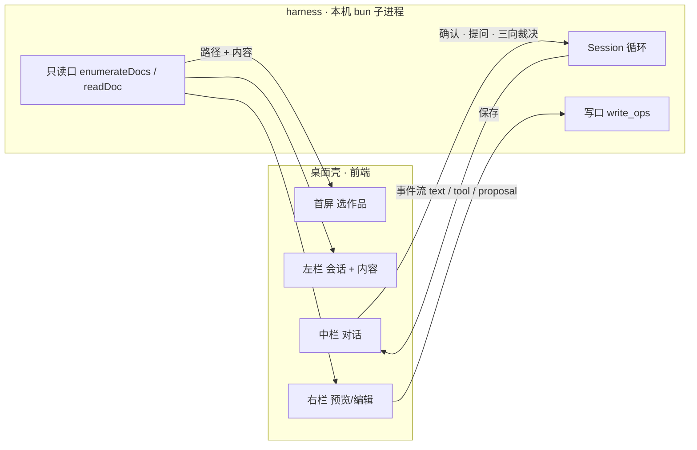

# 桌面端：选作品，然后进写作台

> **职责**：桌面端的设计与实施方案——两个界面长什么样（首屏选作品、项目内三栏）、哪些东西上树、技术选型、进程与数据流、要动核心的哪几处、视觉规范、分阶段落地。
> **读者**：实现桌面端的人；以及要决定"哪些东西给用户看"的人。
> **对齐代码**：**设计稿，尚未实现**（2026-10-01）· 本文引用的都是现有代码：上树范围 `core/config.ts` 的 `DOC_ROOTS`，目录索引 `anchor.ts`，状态卡 `report.ts`，角色行 `characters.ts`，界面接缝 `UserIO` 在 `session.ts`
> 相邻：`product.md`（主流程与用户的两种身份）· `architecture.md`（模块分层与"server 是另一个薄外壳"）· `characters.md` / `outline.md` / `state.md`（三个根各是什么）· `roadmap.md`（UI 阶段）

## 一句话

**界面不是新的一层，它和 CLI 平级——都是交付层。** 这条缝早就留好了：`session.ts` 的 `UserIO` 只有三个口（推事件、要确认、要提问），而三向裁决的注释里写着"今天在 REPL 里用文字问，**将来 UI 用三个按钮**，这一层不动"。界面要做的，是把同一件事换个问法、换个画法。

界面只有两屏：**选作品**，然后**进写作台**。

## 一、首屏：选作品

作品的创建是**低频**操作，总数也有上限——一部小说的周期以年计，一个人手里不会超过十本。低频 + 封顶的东西，值得占满一整屏，也值得做好看。

```
┌──────────────────────────────────────────────────────────────────────┐
│                                                                      │
│   talemate                                                           │
│                                                                      │
│   ┌────────────────┐  ┌────────────────┐  ┌ ─ ─ ─ ─ ─ ─ ─ ─ ─ ┐      │
│   │ test7          │  │ 茶馆           │  │                 │      │
│   │ 历史 · 连载中   │  │ 都市 · 草稿     │  │   ＋ 新建作品    │      │
│   │ 写到第 3 章     │  │ 还没有正文      │  │                 │      │
│   │ 昨天 14:20     │  │ 9月2日         │  └ ─ ─ ─ ─ ─ ─ ─ ─ ─ ┘      │
│   └────────────────┘  └────────────────┘                            │
│                                                                      │
└──────────────────────────────────────────────────────────────────────┘
```

- **一张卡一本书**：书名、题材、进度、最后打开时间。前三样都在现成数据里（`listProjects()` 给标题题材与时间；"写到第几章"就是状态卡里的 `outlineBrief`）。
- **一本都没有时**，这一屏就是一句"还没有作品" + 那个新建卡——空状态不另做一屏。
- **新建**：书名 + 题材（`createProject` 现在就要这两个），建完直接进项目。
- 5–10 张卡时，卡片的进度那一行要读一下每本书——代价很小，真嫌慢再懒加载。

## 二、项目内：三栏

```
┌──────────────────────────────────────────────────────────────────────────────┐
│ ●●●  test7        ← 所有作品      搭档   ● 待你拍板：第 4 章规划     sonnet-5  │
├────────────────────┬───────────────────────────────┬─────────────────────────┤
│ 会话                │ 对话 · 搭档                    │ characters/沈越.md [编辑] │
│   搭档   今天 14:20 │                               │                         │
│   考据   9月28日    │ 你  写第 4 章，让他第一次进县城。│ ### 基本档案            │
│                    │                               │ 姓名：沈越 / 性别：男    │
│ ── 这本书 ──        │ 搭档 ▸ task planner           │ 职业：佃农              │
│ design/            │   规划好了，你看一眼。这一章要  │ 身份 · 所属：佃户，欠着租 │
│   core.md          │   新立一个人，我排在正文前面。  │                         │
│   wiki/            │  ┌─ 第 4 章 · 规划 ──────────┐ │ ### 性格与矛盾          │
│     world.md       │  │ 产物（按序）              │ │ 既认命，又咽不下这口气。 │
│     漕运.md         │  │  1 角色卡 · 牙人 陈六（新）│ │                         │
│   characters/      │  │  2 正文 · 第 4 章          │ │ ### 说话方式            │
│     沈越.md         │  │  3 现状回写 · 沈越 / 伏笔账│ │ 短句，先答后想。         │
│   outline/         │  │ [接受，照这个写] [拒绝] [提意见]│ > "小的……记不清了。"   │
│     vol_1.md       │  └───────────────────────────┘ │                         │
│     vol_1/s1.md    │                               │                         │
│ chapters/          │ 搭档 ▸ 第 3 章改完这一稿要落盘： │                         │
│   chapter_ch1_v1.md│  ┌─ chapters/chapter_ch3_v2.md┐│                         │
│   chapter_ch3_v2.md│  │ - "租子我交。"            │ │                         │
│ state/             │  │ + "租子……我交。"          │ │                         │
│   foreshadowing.md │  │ [允许一次] [这一类都允许] [拒绝]│                       │
│   progress.md      │  └───────────────────────────┘ │                         │
│                    │ ─────────────────────────      │                         │
│                    │ 说点什么…                       │                         │
└────────────────────┴───────────────────────────────┴─────────────────────────┘
```

**左栏就两段，都属于当前这本书**：会话在上、内容在下。项目列表已经从这一栏搬走了——那正是原来"为什么要分上下"那个别扭的来源：项目、会话、内容三样挤在一列里。搬走之后，剩下的两段是同一种东西（都是"这本书的"），分上下就是自然的。

左栏顶部那个「← 所有作品」是回首屏的唯一入口；项目名在标题栏，点它同样回得去。

**"自动展开"的是右栏**：默认不存在，点左栏任一条或点对话里的卡片才出现；打开时中栏被挤窄；可以同时开几份（标签页）。没有打开任何文档时，右栏那一屏是**状态卡**（`report.ts` 现成的：作品名 + 四行现状 + 一句下一步），点任一行就打开对应文档——那是进项目后的第一眼。

## 三、左栏（上）：会话

现成的：`listSessionIds()` + `loadSessionMeta()`（一本书的会话清单，带标题与时间）。点一条恢复那个会话，中栏就接上。新项目建完直接开一个会话，免得上半是空的。

## 四、左栏（下）：目录

左栏下半是**这本书的目录**，标题就叫「目录」（上面已经有一行书名，再写"这本书"是废话）。

**六个固定分段，次序固定**：

```
核心设定            一句话简介：…
世界观              真实历史 · 1426—1435
  漕运
角色
  沈越              佃农，欠着租（必有齐）
大纲
  第 1 卷
    序列 1
正文
  第 1 章
  第 3 章（第 2 稿）
现状
  沈越 / 伏笔账 / 章节流水
```

- **`design/` `chapters/` `state/` 这三个目录名一个都不出现**——它们是实现，不是这本书的样子。
  六段的名字就是 `mate` 对用户说话用的那六个。
- 一段**既可以是分组、又可以是文档**（"世界观"既有一份总纲、又有若干专题页）：点名字开文档、
  点箭头展开。纯分组（"角色"）只展开。
- **目录可收起展开**，默认展开——目录是用来扫的，一进来全收起等于什么都没显示。
- **认不出的照原样列进「其他」**，不静默丢：加了一类文档忘了配名字，也得看得见。

**这一层只有一份**：`framework/anchor.ts` 的 `docTree`（`displayOf` 定"归哪一段、叫什么"），
界面只画不算。CLI 那边将来要对齐也引它——同一份文档在两个界面里有两个名字，是这类映射最典型的烂法。

（**还没收敛的**：`SPECS` 里的「核心层 / 世界层」与状态卡那四个词，与这六个仍是三套。这六段是
"对用户说的那一套"，另两处应当向它对齐——那是改 CLI 输出的事，记在 `roadmap.md`。）

## 五、中栏：对话

**这一块最要紧**，因为它同时装着性质完全不同的东西：用户说的话、mate 说的话、跑过的工具、摆出来的
提案、要用户点头的落盘、要用户回答的问题。**全画成一样的块就会糊成一片**——那是这类界面变乱的头号原因。
所以按两问分四种画法：

| 是什么 | 怎么画 | 为什么 |
|---|---|---|
| 用户说的话 | **右侧气泡** | 只有它是气泡：一次打断，不是正文。宽度随内容，不占满 |
| mate 说的话 | **页面正文**（宋体、无边框、内容列宽） | 它是这个产品的产出，该像稿件一样读；进气泡反而像聊天记录 |
| 跑过的工具 | **折成一组**："做了 N 步"，展开才见细节 | 工具是过程不是内容。一行行裸奔是最常见的乱 |
| 要动手的 | **卡片**，动作按钮长在卡片上 | 提案 / 落盘确认 / 提问都是"等你一句话"，问与答该在同一处 |

**正文不铺在对话里**（用户拍板）。mate 写一章是几千字：它走的是 `write` 的入参，不是正文流；对话里只给
一张**稿子卡**（第几章 · 多少字），**点它 → 右栏读全文**。写着写着把对话淹掉，是这一类界面第二常见的乱。

**需要展示详细的，都在右栏**（用户拍板，这条统辖其余）：对话里的东西是**入口**，不是容器。
一次落盘的改动也一样——对话里只有一行"看改动（右栏）"，diff 在右栏按行着色。
所以右栏装的**不是"文档预览"那一种**，而是一个联合：`doc`（一份文档，markdown）/ `diff`（一次改动的
逐行对比）。将来多一种细节，是给那个联合加一支，不是往对话里再塞一种折叠。

其余的：

- **内容列居中、有最大宽度**（44rem）：一行拉满整屏是最难读也最像草稿的排版。
- **输入区是一个大圆角容器**，发送圆钮与停止钮收在里面；不摊成"textarea + 两个按钮"。
- **三向审阅就是三个按钮**（接受 / 拒绝 / 提意见）。按钮不判断，它只是替用户说那句话
  （`desktop/src/shared/verdict.ts` 的固定短语），**判定仍在 harness 那句整句词表**（fail-closed）——
  "问法归交付层、判定归 harness"这条分工不动。`tests/verdict.test.ts` 钉着两处别走散。
- 顶部一条：当前作品 / 会话、角色与模型、正在写。

### 什么折叠、什么直显——三条判据

界面会不会显得乱，几乎全看这一条分寸。规矩只有三条，其余都是从它们推出来的：

1. **要你读的，还是要你确认它发生过的？** 要读的（mate 的话、正文、提案）**直显**；
   只要确认发生过的（工具调用、长结果、推理）**折成一行**，点开才见细节。
2. **要不要你动手？** 要你点头或回答的**永远直显**——藏进折叠里，用户根本不知道卡住了。
3. **有多长？** 超过一屏的**去右栏**（正文、diff），或截断并写明"还有多少"（工具结果）。

落成一张表：

| 东西 | 怎么显示 | 依据 |
|---|---|---|
| mate 说的话 | 直显，**渲染 markdown** | 要读的 |
| 用户说的话 | 直显（右侧气泡） | 要读的 |
| 工具调用 | 折成一行："做了 3 步 · read、task、write"，点开逐条看 | 只要确认发生过 |
| 工具结果很长 | 折叠里再截断（前 160 字 + "还有 N 字"） | 是证据，不是内容 |
| 写正文 | 稿子卡（第几章 · 多少字），**点它 → 右栏读全文** | 几千字，不能进对话 |
| 推理 | 收起成一行：跑着叫「思考中…」+ 秒数，跑完叫「思考过程」+ 字数 | 过程 |
| 提案 / 落盘 / 提问 | **直显卡片**，动作按钮长在上面 | 要你动手 |
| 落盘确认里的 diff | 卡片上一行"看改动（右栏）" | 要你动手，但 diff 是细节——去右栏 |
| 错误 | 直显一行 | 要你知道 |

**markdown 要渲染，不能当纯文本贴**：贴出来是一堆 `**星号**`，而"渲染过的回复"正是别人那套看起来不像
草稿的原因之一。渲染与右栏预览共用同一份元素样式（`.md`），**也共用同一道 DOMPurify**——
两处都是"外部文本进渲染层"，而渲染层有网络。

**借鉴的出处**：这四行是照着 DuMate（百度搭子）的对话区定的——助手正文不进气泡、过程折成
"加载了 1 个套餐 ⌄" 那样一行、内容列居中、输入框一个大圆角容器。**没借**的是它那些与产品无关的东西
（积分卡、推荐位、"内容由 AI 生成"的免责声明）：我们这边用户是作者，mate 是搭档，不是"AI 帮你干活"。

## 六、右栏：预览与编辑

- **默认只读**，点「编辑」才可改（正文几千字，要滚着读，误触代价大；mate 正在写这一份时也不跟它抢光标）。
- 正文用**宋体**排，界面用**黑体**——稿件与工具的分野，在字上就看得出来。
- 角色卡按格渲染（五格 + 自由长尾），卷纲按格，序列纲整篇散文。
- **保存 = 写文件**：这一版就是文件编辑器语义，不做局部 AI 修改（见下）。
- 这一份开着而别处把它改了（mate 落了新稿）：没在编辑就重载，正在编辑就**不抢**，只在标题旁标一句"文件已更新"。

## 七、界面与 harness 之间的缝



两条纪律：

1. **界面不自己读文件系统。** "什么算一份作品文档"只能有一处（今天在 `core/config.ts` 的 `DOC_ROOTS` 与 `corpus.ts`）；界面要是自己 walk 目录，就会长出第二份，两份迟早说两套话。
2. **裁决喂给同一段判定。** 三向、确认、提问的**问法**归交付层，**判定**归 harness（`session.ts` 已经这么分了）。

形态是桌面应用：harness 仍然跑在本机的 bun 子进程里，桌面壳只做窗口与前端。这与 `architecture.md` 里已经写下的"模块边界必须让 server 能成为另一个薄外壳"是同一条。

## 八、明确不做（这一版）

- **显示名那一层**（把路径显示成中文）。要做的话，有一处得先收拾干净：今天仓库里同时活着**三套中文词**——`mate` 对用户说的四个（核心设定 / 世界观 / 角色 / 大纲）、文档种类注册表里的两个（核心层 / 世界层）、状态卡那四个（核心设定 / 世界观 / 角色现状 / 大纲现状）。界面会把这套词固化在用户眼前，所以那时候必须先收敛成一套（建议以 `mate` 说的那四个为准，另外两处向它对齐）。顺手记在这里，免得将来重新发现一遍。
- **局部 AI 修改**（选中一段让模型改）。它一进来，"用户改的和模型改的怎么合"才成为真问题——那是下一阶段的事，要先想清楚，不是顺手加个按钮。
- **应用层的版本对比**。项目本来就进 git，不在应用层再造一套历史。
- **多用户 / 远程协作**。
- **树的自定义排序与收藏**。`anchor.ts` 那个顺序是有意义的，可配就等于没顺序。

## 九、要动的地方

| | 做什么 |
|---|---|
| **新** | 桌面壳 + 首屏的选作品界面 |
| **新** | 左栏的会话列表与文件树（分组与顺序照 `anchor.ts`，范围照 `DOC_ROOTS`） |
| **改** | 三处核心接口，见「十一」 |

**存量代码几乎没有要动的**：session、循环、工具、写口全部照旧——这正是当初把 `UserIO` 单独划出来的用处。

## 十、技术选型

### 结论

**Electron + electron-vite + React + TypeScript，harness 直接跑在 Electron 主进程里。**

### 为什么是这个（有一个事实支撑它）

`src/` **零 Bun 专有 API**——只有 `node:fs/promises`、`node:path`、`node:crypto` 这些标准内置模块，没有一处 `Bun.`，测试用的 `bun:test` 只在 `tests/`。所以 harness 是一份**跑在 Node 上也成立的普通 TS**，可以直接编进主进程、用普通函数调用驱动，**不需要第二个运行时，也不需要进程间协议**。

反过来说 Tauri：外壳是 Rust，而 harness 仍然需要一个 bun/node 进程——要么要求用户装 bun，要么把 bun 二进制（约 50MB）一起打包，Tauri 省下的包体优势当场抵消；再加上 Rust 只出现在构建链上（打包、签名、公证都躲不开），而仓库里一行 Rust 都没有。**Electron 的代价是包体与内存更大，换来的是"没有新概念"。** 对这个阶段，这笔换算是划算的。

**什么时候回头选 Tauri（或把 harness 拆成 bun sidecar）**：要做 web 版或平板访问的时候。那时正好落在 `architecture.md` 已经写下的那套 server 契约上（`POST /api/session/:id/prompt`、`GET …/event?after=seq` 的 SSE）——那套东西现在不实现，但**模块边界已经为它留好了**。

### Electron 的依赖是怎么装上的（以及本机的坑）

`electron` 这个 npm 包**只是个壳**：真正的运行时（macOS 约 124MB）由**它自己的** postinstall 下载到
`node_modules/electron/dist`，`path.txt` 记着二进制在里面的相对路径，CLI 靠它找到运行时——
**找不到就当场重新下**。所以"装依赖"这件事在这台机器上有三个坑，一次踩全：

1. **Bun 不跑依赖的 postinstall**（`bun install --help` 原文："dependency scripts are never run"；
   `trustedDependencies` 与 `bun install --trust electron` 实测都不触发）。于是那个 postinstall
   从没执行过，二进制从没被下载过——而报错是 `Electron failed to install correctly`，
   跟依赖解析毫无关系。补法：**项目自己的** postinstall（Bun 跑项目脚本）→ `desktop/scripts/ensure-electron.mjs`。
2. **默认从 GitHub releases 下**：本机经代理实测 0.04MB/s（一百多分钟），走 npmmirror 4.4MB/s（二十秒）。
   镜像钉死在那个脚本里，**不指望 `.npmrc` 传进来**——实测 `bun install` 不会把 `.npmrc` 的键导成
   `npm_config_*` 给生命周期脚本，指望它就等于又回到 GitHub。
3. **别手工往 `node_modules` 里塞东西**：手写 `path.txt` 时多带一个换行，electron 就认为二进制不存在、
   又开始重新下载（现象是"什么都没干，它自己在下载"）。

三条合起来，症状都是**看起来卡住**（其实在下 124MB），而原因各不相同。`.npmrc` 里留着
`electron_mirror` 是给 npm / pnpm 用的——**flashnote 用 pnpm，pnpm 默认跑依赖的 postinstall**，
所以那边从来不会碰到第 1 条。验证方式就是那条最短的命令：

```bash
rm -rf node_modules/electron && bun install && ./node_modules/.bin/electron --version
```

### 一个必须在阶段 0 就验掉的风险

**harness 在 Electron 里跑的是 Node，而 dev 与 CI 用的是 Bun。** `src/` 零 Bun 专有 API 让这条风险可控，但"可控"不等于"已验证"——它必须在写第一行界面代码之前用真壳跑通，而不是假设。

### 前端栈

| 层 | 选 | 为什么不选别的 |
|---|---|---|
| 壳 | Electron | — |
| 构建 | **esbuild** 打主进程与预加载，渲染层原样拷过去（阶段 0 已经这么做了） | 阶段 0 要证的是"主进程那条链通不通"，esbuild 一个依赖就够，而且 `desktop/probe` 已经用它验过同一套方式。渲染层到阶段 1 引入 React 时再上 Vite——那时才真的需要 HMR。**少一个框架，就少一处"它自己会不会出问题"** |
| 界面 | React + TypeScript | 仓库全是 TS，不引入第二种语言的心智 |
| 状态 | **渲染层只维护读模型**：进项目先拉一次投影，之后靠事件增量更新。用 Zustand（一个很小的 store，没有模板代码） | 真相在 harness 那边，前端不该有第二份"当前状态"；这也是 `architecture.md` 给薄 TUI 写下的那条（"先拉投影 + 事件增量更新本地读模型"） |
| 样式 | **CSS 变量 + 手写 CSS**，令牌集中在一个文件 | 界面是定制的，不是组件库拼出来的；Tailwind 那层抽象在这里只加噪音 |
| Markdown | marked + DOMPurify | 预览与对话都要，够了 |
| 编辑 | v1 用 `<textarea>`（等宽） | 用户这一版要的就是"和文件编辑器一样简单"；CodeMirror 6 等真需要行号/高亮/多光标时再说 |
| 打包 | electron-builder | macOS/Windows 两条线都覆盖 |

### 打包时必须一起发的两份数据

`prompts/`（模型读的提示词）与 `skills/`（文风卡库）今天是靠 `import.meta.url` 相对解析的（`prompts.ts` 与 `core/config.ts` 的 `builtinSkillsDir`）。打包之后 `import.meta.url` 指向 bundle 内部，**这两份必须作为随包数据一起发**，并且让解析走一个明确的"资源根"，而不是继续假设"代码旁边就是 prompts/"。这件事在阶段 0 就会撞上，不处理的话现象是"提示词读不到、skill 一个都没有"，而且不报错。

## 十一、需要动核心的四处

界面要落地，核心只有四处要让路。**四处都是"补一个已有的东西的口"，不是加机制。**

0. **`.env` 与随包数据的根（已做，2026-10-01）。** 两件事同一个模块（`prelude.ts`），都必须在任何模块读到配置与提示词之前完成：
   - **`prompts/` 与 `skills/` 的根**： `prompts/` 与 `skills/` 今天是按 `import.meta.url` 相对解析的，
    打包后那个 URL 指向 bundle 内部 → 两个目录会被算到构建产物旁边。所以加了 `setResourceRoot()`，
    外壳在启动时钉到随包数据那里；不钉的时候行为与从前完全一样（CLI 与测试不受影响）。
   - **`.env`**：跑 CLI 时 Bun 自动读，**Electron 不读**。不读的后果不是报错，而是静悄悄按默认值跑
     （provider 缺省 `anthropic`、模型缺省 `claude-opus-5`）——你在 `.env` 里配的 DeepSeek 一行都没生效，
     而顶栏还理直气壮地显示着另一个模型的名字。语义与 Bun 一致：**已经设了的变量不覆盖**。
   **踩到的坑值得记下来**：`agent/registry.ts` 在**模块顶层**读提示词，而 ESM 是先求依赖后求自己——
   所以"钉根"那一句写在主进程文件里、哪怕写在最上面也永远晚一步，症状是启动即
   `ENOENT …/prompts/mate.system.txt`，一个看着像路径问题的**求值顺序**问题。它因此是**独立一个
   模块**（`desktop/src/main/prelude.ts`，它**先读 `.env` 再钉资源根**），并且必须是主进程的**第一条 import**。这条有探针钉着。

1. ~~**恢复会话的历史。**~~ **不用动**（2026-10-01 核对）：`storage/session-store.ts` 的 `loadMessages(projectId, sessionId)` 已经是"按 `seq` 排序的消息数组"，主进程直接调它就能拿到历史投影。原先记的"只有内部读"说的是 `Session` 私有那份，是我看窄了——**盘上那一层本来就是公开的**。
2. **三向裁决的结构化入口。** 今天三向是从用户**下一句话的文本**里解析出来的（`draftVerdict` 那套整句词表，fail-closed）。界面上是三个按钮，**不能让按钮去合成一句话再让核心猜**。加一个结构化的入口，**判定仍然走同一个 `verdictEffect`**——问法归交付层、判定归 harness，这条分工不动。
3. **`current.json` 从 `cli.ts` 挪到 `storage/`。** 它是"上次打开哪本书"，今天写在 CLI 里；桌面端与 CLI 共用同一个 `~/.talemate/`，各记一份就会打架。

其余的接口已经就位，不用动：`openSession`（含 `sessionId` 续聊）、`session.post`、`abortCurrent`（停止按钮）、`pendingLabel`（待落盘提案的提示）、`permissionView`（权限面板）、以及 `UserIO` 的三个口。

## 十二、视觉规范

参考的是 **Claude 的克制**（暖中性底、大片留白、用 1px 线而不是阴影分层、强调色只用在真正要你注意的地方）与 **DuMate 的右栏**（任务进程 / 文件 / 能力，见「十三」）。落到我们自己的东西上：**强调色用朱砂**——它是"编辑用红笔"的意思，正好是朱批、批注、待补的那个红。这不是从别人那儿抄来的色，是我们的隐喻本来就有的。

| 令牌 | 浅色 | 深色 | 用在哪 |
|---|---|---|---|
| 底 | `#F6F5F2` | `#15171A` | 窗口底 |
| 面板 | `#FFFFFF` | `#1C1F23` | 中栏、右栏、卡片 |
| 线 | `#E6E3DC` | `#2C3036` | 分隔与边框（**层次靠线，不靠阴影**） |
| 正文 | `#1F1D1A` | `#E8E6E1` | 主要文字、正文 |
| 次文 | `#6B6660` | `#9AA0A6` | 说明、摘要行 |
| 弱 | `#9A948C` | `#6E747B` | 时间、计数 |
| **朱** | `#A8402F` | `#D9705C` | 待补 / 待你拍板 / 破坏性动作 |
| 松 | `#4A6B57` | `#7FA98F` | 已就绪 / 已收 |
| 靛 | `#3C5A7A` | `#8FB0D8` | 模型侧的动作（工具调用） |

- **字体三分**：界面用黑体（`system-ui` / PingFang SC），**正文用宋体**（Songti SC / Source Han Serif），路径与数据用等宽。稿件与工具的分野，在字上就看得出来。
- 间距走 4 的倍数；圆角只有两档（6 / 10）；卡片不用阴影。
- 深色跟随系统，不是另做一套——同一组令牌换值。
- **三种非正常状态各自要说清话**：空（"这本书还没有正文，说一句'写第 1 章'"）、加载（骨架屏，不用转圈）、出错（说清哪一步失败、下一步做什么）。

## 十三、从 DuMate 借来的一处，而且我们有更硬的数据

DuMate 的右栏在任务执行时给三样：**任务进程**（待办清单逐条打勾）、**任务文件**（中间产物与交付物，可点开预览）、**调用能力**（用了哪些工具）。第一样和第三样对我们直接可用，而且第一样我们手里握着**比待办清单更硬的东西**：

> 规划的定义就是"**产物存在即完成**"——一份规划是一串要落地的产物，产物在不在是**可查的**（`chapter-planning.md` 里那条：判据是结果，不是模型自述）。

所以"正在写第 4 章"时，右栏那张进程表不需要模型汇报进度，**直接看文件在不在**：

```
第 4 章 · 产物（按序）
  ✓ 角色卡 · 牙人 陈六        characters/陈六.md
  ● 正文 · 第 4 章            chapters/chapter_ch4_v1.md   ← 正在写
  · 现状回写 · 沈越 / 伏笔账    待做
```

"调用能力"那一栏也现成：`LLMEvent` 里本来就有 `tool-call` / `tool.result`，界面只是把它们从"一大段日志"收成右栏的一行行。

## 十四、仓库布局与构建

**不动现有的布局。** 仓库今天是一份单包（源码在 `src/`，提示词在 `prompts/`，技能库在 `skills/`，测试在 `tests/`），而所有文档与测试都以这个布局为准。挪成 monorepo 会把每一处路径引用改一遍，代价远大于收益。

新增一个 `desktop/` 目录：

```
desktop/
  main/        主进程：外壳 + 起 harness（openSession、事件转发、确认往返）
  preload/     contextBridge：只暴露一组白名单方法，渲染层拿不到 Node
  renderer/    React 应用（首屏 / 左栏 / 中栏 / 右栏 / 视觉令牌）
```

打包器里给 `src/` 一个路径别名，把 `prompts/` 与 `skills/` 当资源发（见「十」最后一条）。脚本：`bun run desktop:dev`（热重载）、`bun run desktop:build`。

**与 CLI 的关系**：两者共用同一个 `~/.talemate/`，同一套会话文件。CLI 里开过的会话，界面里看得到；反之亦然。这不是要做的功能，是同一条数据路径的自然结果——**也因此 `current.json` 那处必须收口**（见「十一」）。

## 十五、分阶段落地

每一阶段结束都应该是**能打开、能看见东西**的，不是"做完了再看"。

| 阶段 | 做什么 | 为什么这个顺序 |
|---|---|---|
| **0** ✅ | 一个最小壳：主进程 `openSession`，界面只有事件流与一个输入框 | 把**风险最大的两件事**先验掉：harness 在 Node 下跑不跑得通、`prompts/` 与 `skills/` 打包后读不读得到。这两件不通，后面全白做 |
| **1** ✅ | 首屏选作品 + 左栏会话列表 + 历史投影 | 打开就有东西看；"拉投影"这条读模型也从这里立起来 |
| **2** ✅ | 左栏文件树 + 右栏只读预览 | 目录与预览是这一版的主体价值 |
| **3** ✅ | 裁决卡片（三向 / 确认 / 提问）+ 停止按钮 + 模式与待落盘提示 | 到这里才算"能用它写完一章" |
| **4** ◐ | 右栏编辑与保存 ✅ + 文件变更自动刷新 ✅ + 「产物按序」进程表 **（卡在一个设计问题上，见下）** | 手改与进度可视化 |
| **5** | 打包分发（macOS / Windows） | 最后再做，前面每一步都能在本机跑 |

### 阶段 0 的结论（2026-10-01）

两条假设都验掉了，第三条**没验**，写在这里免得被绿灯冒充。

`bun run desktop:probe` 把冒烟（mock provider，不需要 key）打成单文件、放到仓库外面跑四遍：

| 第几遍 | 怎么跑 | 应当 | 它证明什么 |
|---|---|---|---|
| 1 | 不钉资源根 | **失败**，且错在找不到文件 | 打包后 `import.meta.url` 确实指向 bundle 内部，且"钉根"不是摆设 |
| 2 | 钉根 + `node` | 通过 | **harness 在 Node 上跑得通**（Electron 主进程就是 Node） |
| 3 | 钉根 + `bun` | 通过 | 同一份产物不绑死在哪个运行时上 |
| 4 | 主进程自检（electron 用桩） | 通过 | 主进程那段代码真的跑得起来——**它在修好"钉根"的求值顺序之前是红的** |

**没验的那条**：真正的 Electron 运行时。开发机上经代理拉不下 Electron 的二进制（100MB+，实测
十分钟只到 13MB），所以第 4 遍把 `electron` 换成了一个桩——**它验的是我们的代码，不是 Electron**。
窗口、preload、IPC 这几条只有在装了二进制的机器上跑才作数：

```
bun run desktop          # 构建 + 开窗口（需要 electron 的二进制：bun run desktop:setup）
bun run desktop:selftest # 不开窗口，主进程跑一个 mock 回合
```

### 阶段 4 卡住的那一处：「产物按序」进程表

那张表（从 DuMate 借来、我们数据更硬的那张）要"逐条打勾"，前提是**知道这一章的产物是哪些**。
而这个前提今天不成立——**规划是自由文本**：`propose-plan` 要求它写成「产物（按序）」那样一列，
但 `chapter-planning.md` 明说"**代码不校验规划的形状**（不认识「产物」那一节）"，判据只是"字节能不能
到用户眼前"。于是想打勾就得**解析散文**，而那正是仓库一直拒绝做的事（形状判断只能有一处，
而且不能长在界面里）。

两条出路，是一次**设计决定**，不是补个功能：

1. **让规划带上结构**（比如产物那一段用可解析的形状登记）——收益是进度可算、可勾；代价是给规划加了一份
   它今天没有的契约，且与"不许把形状判断分散"那条要一起想清楚（谁解析、在哪一层）。
2. **不做那张表**。规划本来就整篇摆在对话里（提案卡），产物在不在看左栏的树——两处已经是"人自己看"的
   形态，而不必让机器再算一遍。

**先不做，等真的有"写到一半不知道还剩什么"的痛感再说**——那时也才知道该往哪一层加。

### 阶段 2 的结论（2026-10-01）

左栏文档树、右栏只读预览落地。三处值得记下来的：

- **"目录怎么组织"这条判据只写了一遍。** 我第一版在壳里按字母序排（那是第二份判据），随后挪回
  `framework/anchor.ts` 的 `docTree()`：顶层按 `DOC_ROOTS` 的次序、同层目录在前、其余按
  **`numeric`** 比较。那个 `numeric` 不是洁癖——`chapter_ch2` 与 `chapter_ch10` 按字典序正好反过来，
  而界面上一眼看得出的顺序错，比"少了点什么"更让人以为程序坏了。四条测试钉着它（`framework.test.ts`）。
- **markdown 必过 DOMPurify。** 文档里可能贴进任何东西（查证时从网页抄来的片段、用户自己粘的
  HTML），而渲染层是有网络的那一侧——一个 `` 就够把稿子送出去。不是洁癖。
- **树在一轮结束之后重取**（`busy` 由真变假那一刻）：mate 刚写的正文要出现在树上，否则用户会以为它没写。
  真正的文件监听（`fs.watch`）留到阶段 4 与编辑一起做。

### 阶段 1 的结论（2026-10-01）

首屏选作品、左栏会话列表、历史投影都落地了，**核心一行没动**——原先以为要补的"历史读口"本来就在
（见「十一」第 1 条）。渲染层这一阶段换成 React（`@vitejs/plugin-react`），于是多了两处配置事实：

- **插件版本要跟 Vite 的版本对齐**。electron-vite 5 带的是 Vite 7，而 `@vitejs/plugin-react@6`
  要 Vite 8（它 import 了 `vite/internal`）——装最新版会在加载配置时直接报
  `ERR_PACKAGE_PATH_NOT_EXPORTED`。用 `^5`（peer 是 `^4.2 || ^5 || ^6 || ^7`）。
- **两份 tsconfig**：根那份是 Node 侧（harness + 主进程 + 预加载 + 探针），渲染层单独一份
  （DOM + jsx + node 类型）。node 类型在渲染层那边是**被迫**加的——它要用 `StoredMessage`，
  消息模型只有一份定义、不许手抄，而它顺着 `core/types → permission` 把 `process.platform` 拉了进来。
  渲染层不能碰 Node 这条保证不靠类型系统，靠 preload 白名单与打包器。

**新的一档验证：窗口自检**（`bun run desktop:selftest:window`）。开一个不显示的窗口，等**渲染层**
报"首屏画出来了"（`App` 取到数据之后才报，所以它同时证明了 IPC 与渲染）。这是唯一能抓到**白屏**的
地方——产物缺个 js、路径不对、一上来就抛异常，全都是"一片空白而控制台什么都没有"。
它的局限也写在代码里：只验到**首屏**，会话/对话那一屏要人点一下才到，阶段 1 没有覆盖。
